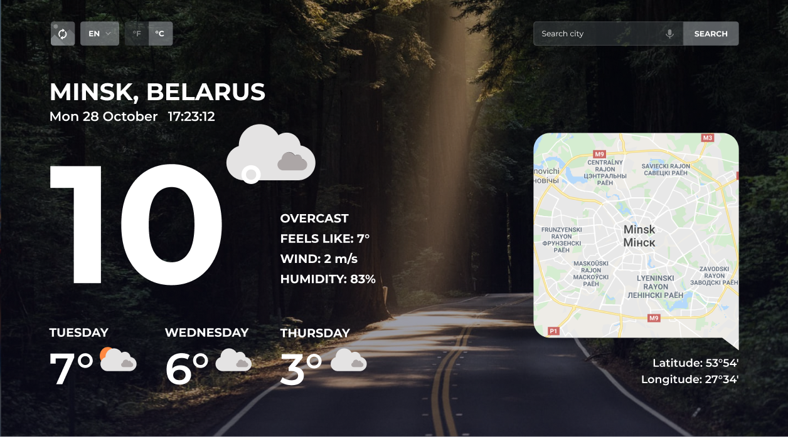

| Deadline | Folder name | Branch name |
| ----------- | ------------- | ------------- |
| 31.05.2020 23:59 | fancy-weather | fancy-weather |

# fancy-weather

1. Task: https://github.com/rolling-scopes-school/tasks/blob/master/tasks/fancy-weather.md
2. Screen: https://imgur.com/ZTUv8Qf
3. Completed task: https://romanenkoandrew-fancy-weather.netlify.app/
4. 09.06.2020 / 31.05.2020
5. Max score: 300 points
6. Score: 175 points  

## Задание

Вам необходимо создать приложение - прогноз погоды

### Структура приложения

Приложение состоит из четырёх функциональных блоков.
- Блок контроля
- Погода за сегодня
- Прогноз погоды на три дня
- Геолокационные данные

Макет приложения:

[Макет в Figma](https://www.figma.com/file/3aQwTNcZWg5CTuvlQ1t5MQ/fancy-weather?node-id=0%3A1)

*В предложенный макет можно вносить свои изменения с целью его улучшения, не удаляя и не упрощая представленные на макете элементы дизайна*

### Описание функциональных блоков

**1. Блок контроля**

- кнопка для переключения фонового изображения
- кнопка для переключения языка (en/ru/be)
- кнопка для переключения единиц измерения температуры (°C/°F)
- строка поиска

**2. Погода за сегодня**

- название населённого пункта, название страны
- текущая дата: день недели в коротком формате, число, месяц. Например: Сб 26 октября
- время: часы, минуты, секунды. Например: 17:23:12. Обновляется раз в секунду
- температура в текущий промежуток времени
- описание погоды (summary), ощущаемая температура (apparent temperature), скорость ветра(м/с), влажность(%)
- иконка погоды

**3. Прогноз погоды на три дня**

- день недели в полном формате
- средняя температура
- иконка погоды

**4. Геолокационные данные**

- координаты населённого пункта: долгота и широта (в градусах и минутах)
- карта местности

## Работа приложения

- Когда пользователь открывает приложение, все данные на странице относятся к текущему местоположению пользователя
- В строке поиска осуществляется поиск по населённому пункту
- Фоновое изображение изменяется при обновлении содержания страницы или при клике по кнопке для переключения фонового изображения в блоке контроля
- Настройки при первом запуске приложения: язык – английский, единицы измерения температуры – градусы Цельсия: 
  - переключатель языка изменяет язык отображения текста страницы (en/ru/be).  
  - переключатель температуры изменяет единицы измерения температуры (°C/°F).
  - пользовательские настройки языка и температуры сохраняются в local storage.
- Голосовое управление:
  - рекомендуемые кодовые фразы:
    - озвучить прогноз погоды: "weather", "forecast"
    - увеличение громкости: "louder"
    - уменьшение громкости: "quieter"
  - допустимо реализовать по одной фразе для каждого элемента управления
  - в случае использования других фраз, используемые комбинации необходимо указать доступном проверяющему месте

  
## Технические требования

- приложение корректно работает в последней версии Chrome
- можно использовать css-препроцессоры, bootstrap, material design, lodash.js
- разрешается использовать jQuery или другие JS библиолеки только в качесте подключаемой зависимости для UI библиотек. Использование jQuery и JS библиотек в основном коде приложения не допускается
- использование Angular / React / Vue допускается только по личной договорённости с ментором

## Критерии оценки:

**Максимальный балл за задание: 250 баллов при кросс-чеке / 300 баллов при проверке ментором**

### Basic scope +80

- [x] вёрстка, дизайн, UI **30 баллов**
  - [x] минимальная ширина страницы, при которой она отображается корректно – 320 рх. Все указанные в задании элементы присутствуют как на десктопной, так и на мобильной версии +10 
  - [x] приложение корректно отображается для любого выбранного языка, единиц измерения температуры, указанного в поиске населённого пункта +10
  - [x] внешний вид приложения внешне соответствует макету или является его улучшенной версией +10
- [x] В блоке "Погода за сегодня" корректно отображаются данные, относящиеся к текущему местоположению пользователя – **20 баллов**
  - [x] данные о погоде и местоположении пользователя - +10
  - [x] дата в указанном в описании задания формате, часы, обновляющие время каждую секунду +10 
- [x] В блоке "Прогноз погоды на три дня" корректно отображаются данные, относящиеся к текущему местоположению пользователя – **10 баллов**
- [x] В блоке "Геолокационные данные" корректно отображаются данные, относящиеся к текущему местоположению пользователя – **20 баллов**  
  - [x] карта с маской (форма карты отличная от прямоугольной) и маркером населённого пункта +10
  - [x] координаты в градусах и минутах +10

### Advanced scope +80/+130

- [x] Реализован поиск. Если в поиске вводится корректный запрос, по которому каждый из использованных API возвращает результат. Все данные на странице, в том числе дата и время, обновляются в соответствии с указанным в поиске населённым пунктом – **50 баллов**
  - [x] поиск работает как при нажатии на клавишу Enter в поле поиска, так и при клике на кнопку Поиск +5
  - [x] поиск корректно работает для разных населённых пунктов - больших и маленьких, столиц и посёлков +10
  - [x] при вводе в поле поиска некорректных запросов, по которому API возвращает ошибку, приложение не ломается, выводится уведомление об ошибке. Возникающие ошибки в работе с API (прерывание соединения в ходе запроса, возвращаемые ошибки от API типа 4xx, 5xx) также обрабатываются клиентом и выводятся в область уведомления об ошибке +10
  - [x] дата и время указываются для того часового пояса, в котором находится указанный в поле поиска населённый пункт +10
  - [x] если у координаты есть знак минус, он тоже выводится, или возле координаты выводится буква, обозначающая широту (северная (N), южная (S)) и долготу (восточная (E), западная (W)) +5
  - [x] одновременное обновление всех элементов страницы при вводе нового населенного пункта после получения успешного ответа по каждому из запросов (название по локации приходит быстро, а погода, иконки ее и т.п. - медленно). В случае возникновения ошибки по одному из запросов данные не обновляются +10
- [x] При обновлении страницы или клике на кнопку для переключения фонового изображения меняется фоновое изображение – **20 баллов**
  - [x] фоновое изображение генерируется с учётом поры года и времени суток указанного в поле поиска населённого пункта (по желанию можно добавлять и другие параметры поиска). Если возникла ошибка в ходе получения картинки, использовать любое стандартное фоновое изображение. Так как API для картинок не всегда возвращает правильный результат, данные о параметрах запроса фонового изображения для удобства в ходе проверки ментором или в процессе кросс чека выведите в консоль +10
  - [x] плавная смена фонового изображения, изображение сначала загружается и только потом меняется, у изображения есть полупрозрачный оверлей или используется другой способ, обеспечивающий чёткость и контрастность надписей +10
- [x] Переключение единиц измерения температуры – **10 баллов**
  - [x] при смене шкалы отображения температур происходит пересчёт температур в соответствии с выбранной шкалой и меняется отображение активной кнопки, позволяющей определить, какая шкала сейчас активна. При перезагрузке страницы сохраняется выбранная пользователем шкала отображения температур +10
- [x] Выполнены требования к коду – **30 баллов** (оценивает только ментор) 
  - [x] js код разбит на модули +10
  - [x] используется webpack +10
  - [x] используются editorconfig, eslint, eslint-config-airbnb-base, babel  +10 
- [ ] Реализованы юнит-тесты, использующие различные [методы jest](https://jestjs.io/docs/ru/expect) – 2 балла за каждую покрытую функию/метод, но не больше **20 баллов** (процент покрытия каждой функции/метода не учитывается) (оценивает только ментор)

### Hacker scope +90

- [ ] Реализовано голосовое управление/уведомление - **40 баллов**
  - [ ] есть возможность включения/ выключения микрофона по клику, есть индикация активного и неактивного состояния микрофона +5
  - Голосовой поиск по названию населённого пункта
    - [ ] после того, как название населённого пункта произнесено, поиск срабатывает автоматически, без необходимости кликать на кнопку +10
    - [ ] поиск ведётся на языке отображения страницы, если срабатывает поиск и на другом языке тоже, это не является ошибкой +5
  - [ ] Голосовое уведомление о погоде на сегодня
    - [ ] при клике по кнопке проигрывания звука есть возможность прослушать звуковое уведомление о прогнозе погоды +5 
    - [ ] голосовое уведомление о прогнозе погоды можно запустить произнеся кодовую фразу. +5
    - [ ] голосом можно регулировать громкость уведомления +5
    - [ ] кодовые фразы управления громкостью не запускают поиск по названию населенного пункта +5
-  [ ] Перевод текста страницы (en/ru/be) – **30 баллов**
  - [ ] переводится весь текст страницы. Не является ошибкой отсутствие перевода карты +10
  - [ ] название населённого пункта и страны всегда отображается на выбранном языке +10
  - [ ] перевод на текущий выбранный язык названий дней недели и месяцев +5
  - [ ] при перезагрузке страницы сохраняется выбранный пользователем язык +5
- [ ] Бонусные баллы за качество приложения – **20 баллов** 
  - [ ] оригинальный интересный качественный дизайн приложения, иконки погоды и кнопки анимированы, для анимации используются ключевые кадры или svg-анимация +10
  - [ ] продуман и реализован не предусмотренный заданием дополнительный функционал +10 

### Штрафные баллы  

- [ ] используются ключи доступа к API указанные в задании, а не свои личные – **10 баллов** (оценивает только ментор)    
- [ ] меньше 5 коммитов, ошибки в названиях коммитов, ошибки в pull request - **10 баллов** (оценивает только ментор) 
- [x] присутствуют ошибки в консоли, связанные с исполняемым кодом (ошибки типа favicon.ico: Failed to load resource: the server responded with a status of 404 или ошибки, связанные с запросами к API, не учитываются) или предупреждения eslint-config-airbnb-base: **-15 баллов** (оценивает только ментор)

### Ключевые навыки

- работа с API
- получение данных при помощи асинхронных запросов
- дата и время
